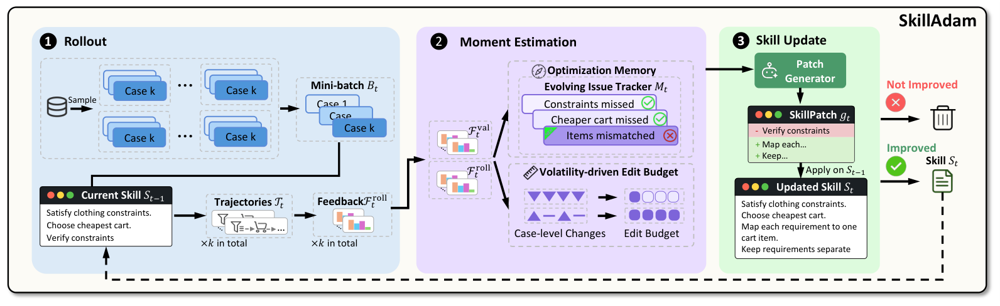

<p align="center">
  
</p>

# SkillAdam: An Adam-Inspired Framework for Stable and Efficient Skill Self-Evolution

[](assets/SkillAdam.pdf)
[](pyproject.toml)
[](LICENSE)
[](https://github.com/ruc-datalab/SkillAdam)

> **Authors:** Gaoyuan Li<sup>1</sup>, Meihao Fan<sup>1</sup>, Yizhe Liu<sup>1</sup>, Shaolei Zhang<sup>1,*</sup>, Ju Fan<sup>1</sup>, Siyi Wang<sup>2</sup>, Jiaheng Hou<sup>2</sup>, Xudong Weng<sup>2</sup>, Honghan Tian<sup>2</sup>, Zang Li<sup>2</sup>
>
> <sup>1</sup> Renmin University of China &nbsp; <sup>2</sup> Tencent &nbsp; <sup>*</sup> Corresponding author

**SkillAdam** turns agent execution feedback into better, reusable skills. It optimizes natural-language skill documents while keeping the underlying language model frozen. Inspired by Adam, it uses **optimization memory** to maintain a consistent revision direction and a **volatility-driven edit budget** to control how much to change at each iteration.

- **Learn from experience.** Build an initial skill from execution trajectories, then refine it through task feedback and evaluated patches.
- **Preserve useful corrections.** Track problems, previous solution attempts, and their outcomes across iterations.
- **Adapt the scope of each update.** Reduce the edit budget when case-level improvements are inconsistent, and allow broader revisions when the evidence is more consistent.
- **Use it with your agent.** Optimize an existing `SKILL.md` through integrations for **Codex, Claude Code, Cursor, and GitHub Copilot**.
- **Explore the research.** Access seven benchmark adapters, ten selected skill artifacts, experiment profiles, and scripts for evaluation and token accounting.

<p align="center">
  
  <br>
  <em>SkillAdam's optimization loop, from Figure 2(b) of the paper.</em>
</p>

<p align="center">
  <a href="#quick-start">Quick Start</a> ·
  <a href="#how-it-works">How It Works</a> ·
  <a href="#benchmark-results">Results</a> ·
  <a href="#develop-your-own-skilladam">Reproduction</a> ·
  <a href="#documentation">Documentation</a> ·
  <a href="#citation">Citation</a>
</p>

## News

- **[2026.09]** SkillAdam's code is released, including integrations for four agent platforms, seven benchmark adapters, selected skills, and reproduction scripts.

## Quick Start

### Requirements

- **Python 3.10+**, with `pip` and `venv`, and **Git**.
- One supported agent CLI, installed, signed in, and available on your `PATH`: `codex`, `claude`, `cursor-agent`, or `copilot`.
- For Copilot's default VS Code integration, the **`code` CLI** is also required. For Copilot CLI only, pass `--skip-vscode-registration` to its installer.

Cursor requires the **Cursor Agent CLI**; the desktop app alone is insufficient. The default plugin setup reuses your agent platform's sign-in and needs no local GPU, Docker, or separate model API key. Model calls consume your platform account's quota.

### Install for Your Agent

```bash
git clone https://github.com/ruc-datalab/SkillAdam.git
cd SkillAdam
```

Run **one** installer for your platform from the repository root:

| Platform | macOS / Linux |
|---|---|
| Codex | `./integrations/codex/install.sh` |
| Claude Code | `./integrations/claude-code/install.sh` |
| Cursor Agent | `./integrations/cursor/install.sh` |
| GitHub Copilot | `./integrations/github-copilot/install.sh` |

<details>
<summary>Windows PowerShell</summary>

| Platform | Command |
|---|---|
| Codex | `.\integrations\codex\install.ps1` |
| Claude Code | `.\integrations\claude-code\install.ps1` |
| Cursor Agent | `.\integrations\cursor\install.ps1` |
| GitHub Copilot | `.\integrations\github-copilot\install.ps1` |

</details>

The installer creates a dedicated Python environment, installs SkillAdam, and registers the integration. Restart your agent after installation; in VS Code, use **Developer: Reload Window**.

For installation previews, model configuration, updates, and troubleshooting, see the [platform guide](integrations/README.md).

### Optimize a Skill

Open the workspace containing your skill and select **`skilladam-optimize`** through your agent's skill picker or invocation mechanism. Then provide the skill path and your goal:

```text
Use SkillAdam to optimize /absolute/path/to/SKILL.md for producing accurate,
well-structured research summaries with traceable sources.
```

Your agent prepares evaluation tasks and scoring rules. SkillAdam runs the skill, proposes edits, and compares each candidate with the current version. **By default, proposed edits are selected automatically; the source file is updated only when the acceptance gate passes.**

To review and select individual changes, include:

```text
Before applying changes, show me the proposed edits and let me choose.
```

The default plugin run uses **8 tasks**, reserves **3 for final held-out evaluation**, and performs **up to 3 optimization iterations**. These settings are separate from the paper experiments. If a run is interrupted, ask your agent to resume with the same run directory.

The current integration optimizes one `SKILL.md`. Evaluation tasks must be self-contained: companion skill resources and workspace files are not automatically copied into inner task executions. See the [platform guide](integrations/README.md#tasks-and-evaluation-signals) for task design and platform differences.

## How It Works

SkillAdam applies Adam's design principles to discrete skill documents. Its memory and budget play analogous roles to first- and second-moment estimates; the framework uses execution feedback and text edits to update the skill.

1. **Trajectory-informed initialization.** When no initial skill is supplied, Stage0 analyzes execution trajectories and their feedback to construct reusable guidance.
2. **Execution and feedback.** Run the current skill on a sampled batch of tasks and summarize the observed successes and failures.
3. **Optimization memory.** An evolving issue tracker records identified problems, attempted solutions, and resolved or reopened issues. This history guides the next revision.
4. **Volatility-driven edit budget.** Track a moving average of the variance in per-case performance changes. Higher volatility reduces the number of permitted edits in the next patch.
5. **Patch and acceptance.** Generate a bounded unified diff, evaluate the candidate, and accept it only when the benchmark's improvement and non-regression rules are met. Save the updated skill and optimizer state for the next iteration.

In the **paper protocol**, the current and candidate skills are evaluated on the **same sampled optimization batch**. Test cases are reserved for final evaluation. The research CLI also supports a separate validation batch; the [architecture guide](docs/architecture.md) explains the protocols and implementation.

## Benchmark Results

The following results are reported in **Tables 2 and 3 of the [paper](assets/SkillAdam.pdf)**. Scores are percentages; higher is better. The target models remain frozen, and skills are supplied as natural-language instructions. See the [reproduction notes](#reproduction-notes) for the distinction between paper results and repository reference records.

### Short-Horizon Tasks

These experiments use **GPT-5.5**. As specified in the paper, the short-horizon baseline values follow the no-harness results reported by SkillOpt.

SearchQA, OfficeQA, and LiveMath use exact match; SpreadsheetBench uses hard task success; DocVQA uses ANLS-hard.

| Method | SearchQA | SpreadsheetBench | OfficeQA | DocVQA | LiveMath (LMB) |
|---|---:|---:|---:|---:|---:|
| NoSkill | 77.7 | 41.8 | 33.1 | 78.8 | 37.6 |
| HumanSkill | 81.8 | 72.9 | 66.9 | 90.1 | 38.4 |
| LLMSkill | 80.9 | 43.2 | 51.7 | 89.6 | 40.0 |
| Trace2Skill | 82.4 | 49.6 | 65.7 | 90.6 | 52.0 |
| TextGrad | 81.4 | 41.1 | 42.0 | 87.2 | 49.2 |
| GEPA | 84.8 | 73.6 | 63.9 | 89.1 | 43.2 |
| SkillOpt | 87.3 | 80.7 | **72.1** | 91.2 | 66.9 |
| **SkillAdam** | **87.5** | **81.1** | **72.1** | **92.3** | **67.7** |

SkillAdam achieves the highest reported score on four of the five benchmarks and ties SkillOpt on OfficeQA.

### Long-Horizon Tasks

ALFWorld uses **GPT-5.5** and reports episode goal completion. DeepPlanning uses **Claude Sonnet 4.5** and reports case accuracy for shopping under multiple constraints and travel planning.

| Method | ALFWorld | DP-Shopping | DP-Travel | DP-Avg |
|---|---:|---:|---:|---:|
| NoSkill | 83.6 | 31.7 | 0.0 | 15.8 |
| SkillOpt | 87.3 | 41.7 | 1.7 | 21.7 |
| **SkillAdam** | **89.6** | **45.0** | **11.7** | **28.3** |

DP-Avg averages the unrounded shopping and travel accuracies. Shopping aggregates its three difficulty levels by case count.

### Optimization Efficiency and Transfer

On DeepPlanning, SkillAdam improves task performance while using fewer optimization tokens and requests (**paper Table 6**):

| Optimization-phase usage | SkillOpt | SkillAdam | Reduction |
|---|---:|---:|---:|
| Total tokens | 226.6M | **74.0M** | **67.3%** |
| API requests | 9,071 | **2,830** | **68.8%** |

This comparison covers the optimization phase across the four DeepPlanning scopes, excluding Stage0 initialization, final test evaluation, and smoke tests.

The paper also transfers the learned skills from **GPT-5.5 to GPT-5.4-mini without further optimization**. Across six benchmarks, SkillAdam reaches an average target-model score of **67.8%**, compared with **63.1%** for SkillOpt, and a mean score-retention ratio of **81.3%** versus **76.2%** (**paper Table 5**).

## Develop Your Own SkillAdam

Use the research package to inspect learned skills, reproduce benchmark experiments, or extend the optimizer. Run the commands below from the repository root. Keep benchmark data and run outputs outside the checkout.

### 1. Install the Research Package

```bash
python -m venv .venv
source .venv/bin/activate
python -m pip install --upgrade pip
python -m pip install -e .
python -m skilladam list-benchmarks --json
```

On Windows, activate the environment with `.\.venv\Scripts\Activate.ps1`.

The core package has no mandatory third-party runtime dependencies. For real experiments, install the requirements for your chosen benchmark, for example:

```bash
python -m pip install -r skilladam/benchmarks/searchqa/requirements.txt
python -m skilladam check-environment --benchmark searchqa
```

The environment check is offline. It checks dependencies; dataset preparation and provider setup are separate steps. See [dependencies](docs/dependencies.md), [datasets](docs/datasets.md), and [backend configuration](docs/reproducibility/openai_compatible_backend.md).

### 2. Explore the Released Skills

The repository includes **ten selected skills across seven benchmarks**, with artifact provenance and checksums recorded in the [skill manifest](skilladam/artifacts/skills/manifest.json).

| Benchmark | Task | Selected skill |
|---|---|---|
| ALFWorld | Interactive household tasks | [Skill](skilladam/artifacts/skills/alfworld/best_skill.md) |
| DocVQA | Document image question answering | [Skill](skilladam/artifacts/skills/docvqa/best_skill.md) |
| SearchQA | Question answering from search evidence | [Skill](skilladam/artifacts/skills/searchqa/best_skill.md) |
| SpreadsheetBench | Spreadsheet manipulation | [Skill](skilladam/artifacts/skills/spreadsheetbench/best_skill.md) |
| OfficeQA | Question answering over Treasury documents | [Skill](skilladam/artifacts/skills/officeqa/best_skill.md) |
| LiveMathematicianBench (LMB) | Mathematical reasoning | [Skill](skilladam/artifacts/skills/lmb/best_skill.md) |
| DeepPlanning | Constrained shopping and travel planning | [Shopping L1](skilladam/artifacts/skills/deepplanning/shopping_level1.md) · [L2](skilladam/artifacts/skills/deepplanning/shopping_level2.md) · [L3](skilladam/artifacts/skills/deepplanning/shopping_level3.md) · [Travel](skilladam/artifacts/skills/deepplanning/travel_en.md) |

Load an artifact directly in Python:

```python
from skilladam.artifacts import load_best_skill

searchqa_skill = load_best_skill("searchqa")
travel_skill = load_best_skill("deepplanning", scope="travel_en")
```

Use these artifacts for inspection and evaluation. For comparative training, generate a **shared Stage0 initial skill** and pass it to both SkillAdam and SkillOpt.

### 3. Reproduce Training and Evaluation

The versioned [experiment profile](skilladam/experiments/main_results.json) records model IDs, data splits, Stage0 cases, prompts, sampling, gates, and optimization parameters. The repository includes separate SkillAdam and SkillOpt runners, evaluation commands, and usage reporting.

After preparing your benchmark data, generate a SearchQA experiment plan:

```bash
python scripts/reproduce_main_results.py \
  --benchmark searchqa \
  --method all \
  --phase all \
  --data-root ../skilladam-data/searchqa \
  --backend skilladam.backends.openai_compatible:create_backend \
  --backend-config configs/backends/gpt55_searchqa_main_result.example.json \
  --output-root ../skilladam-runs/searchqa
```

This command **prints the Stage0, training, and evaluation commands without calling a model**. Configure the provider and data paths, review the generated plan, then add `--execute --confirm-api-costs` to run it. The six non-DeepPlanning paper profiles use OpenRouter with `openai/gpt-5.5`; DeepPlanning uses the dedicated official backend with `claude-4-5-sonnet-20250929`, plus `gpt-4.1` for travel-plan conversion.

Backends read credentials from explicitly named environment variables. [`.env.example`](.env.example) documents the names and is not loaded automatically.

Runs save skill checkpoints, per-case outputs, evaluation metrics, and token/request ledgers. Continue with the [reproduction guide](docs/reproducibility/main_results.md), [CLI reference](docs/reproducibility/quickstart.md), and [cost comparison guide](docs/reproducibility/cost_comparison.md).

<a name="reproduction-notes"></a>

<details>
<summary>Paper results, experiment profiles, and artifact provenance</summary>

- The results above follow the supplied paper. The repository's experiment profile cites a different manuscript title and PDF checksum and records separate baseline reference values for the five short-horizon benchmarks. Those values differ from the paper's NoSkill row and should not replace it.
- Selected skill artifacts carry their own historical evaluation evidence. These records should not be substituted for the paper tables or treated as fresh reproduction results.
- For DeepPlanning, the executable training framework is E2, with optimization memory and the adaptive edit budget. The packaged selected evaluation skills are E1 artifacts, as documented in the [reproduction guide](docs/reproducibility/main_results.md#skilladam-settings).
- SearchQA's packaged skill includes optimizer-learned answer-form examples; it is not a zero-shot artifact.

</details>

## Documentation

| Topic | Guide |
|---|---|
| Agent integrations, configuration, and patch review | [Platform guide](integrations/README.md) |
| Core optimizer, gates, checkpoints, and execution backends | [Architecture](docs/architecture.md) |
| Benchmark dependencies and external runtimes | [Installation requirements](docs/dependencies.md) |
| Dataset acquisition and split preparation | [Data preparation](docs/datasets.md) |
| Research commands and selected skills | [Research quick start](docs/reproducibility/quickstart.md) |
| Experiment settings and result verification | [Main-result reproduction](docs/reproducibility/main_results.md) |
| SkillOpt implementation and comparison protocol | [SkillOpt baseline](docs/reproducibility/skillopt_baseline.md) |
| API usage, token counts, and explicit pricing | [Cost reporting](docs/reproducibility/cost_comparison.md) |

## Contribution

We welcome contributions to benchmark adapters, agent integrations, optimization methods, documentation, and evaluation examples.

To report a problem, open an [issue](https://github.com/ruc-datalab/SkillAdam/issues) with the platform or benchmark, relevant configuration, and steps to reproduce it. For implementation changes, refer to the [architecture](docs/architecture.md) and [validation guide](docs/testing.md), then submit a pull request. Use synthetic examples when sharing tasks or execution traces.

## Acknowledgements

We thank the authors and maintainers of SkillOpt and the seven benchmarks used in this project. The repository preserves the SkillOpt license and attribution for reused and adapted components. See [NOTICE](NOTICE) and [licensing details](docs/licensing.md) for third-party attribution and dataset terms.

## Citation

If you find SkillAdam useful in your research, please cite the paper:

```bibtex
@misc{li2026skilladam,
  title  = {SkillAdam: An Adam-Inspired Framework for Stable and Efficient Skill Self-Evolution},
  author = {Gaoyuan Li and Meihao Fan and Yizhe Liu and Shaolei Zhang and Ju Fan and Siyi Wang and Jiaheng Hou and Xudong Weng and Honghan Tian and Zang Li},
  year   = {2026},
  note   = {Manuscript},
  url    = {https://github.com/ruc-datalab/SkillAdam}
}
```

## License

SkillAdam is released under the [MIT License](LICENSE). Copyright (C) 2026 Tencent. All rights reserved. Third-party components and datasets retain their respective licenses and terms; see [NOTICE](NOTICE).
